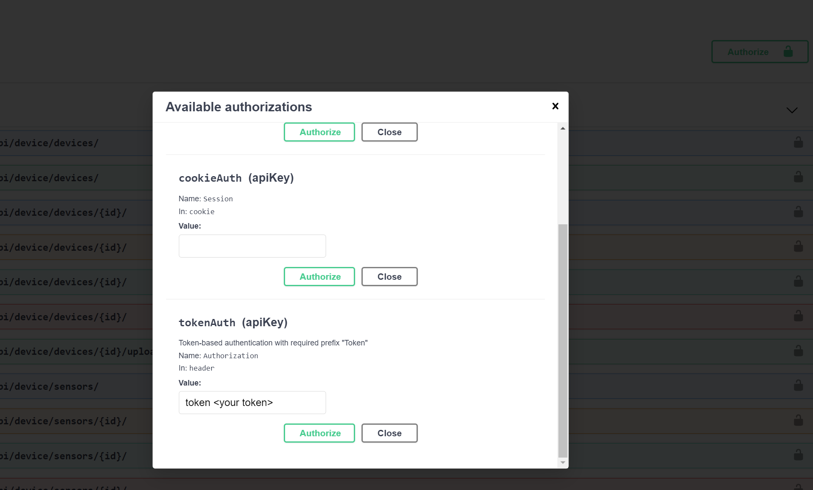

# Device Manager

This API allows multiple users to authenticate and create their own devices with associated sensors, tags, and images. The API also provides endpoints to filter devices by tags and sensors, as well as check which sensors are assigned to a specific device.

### Requirements

- Docker
- Git

### Installation Steps

To install and set up the project locally

- Clone the project

  ```
  git clone git@github.com:singerGUO/data-driven-app.git
  cd data-driven-app
  ```

- Build the docker-container and configure the project by running `docker-compose build`

## Usage

The backend is built with TDD process and 61 Testcases was implemented including authentications, CRUD, querysets filtering, and health check.

### Examples

**Test the Local project is running** 

##### Change the .env files

```
mv .env.sample .env 
```

Note: Ensure you create an `.env` file before starting the service.

##### Build the container and orchestra services

```
docker-compose build
```

##### Integration test and Unit test

```cmd
docker-compose run --rm app sh -c "python manage.py test"
```

##### Run the service

```shell
docker-compose up
```

##### Swagger UI

http://127.0.0.1:8000/api/docs/#/

##### Database Management locally

http://127.0.0.1:8000/api/admin/#/

###### create a super user for log into admin

```shell
docker-compose run --rm app sh -c "python manage.py createsuperuser"
```


#### Authorize as user

### 



Before creating any entities like devices and sensors. You need to create an user, and authorize as user with generated token by entering your token in the form of `token <your token>` after clicking Authorize button on the right top

After that, all continue request headers will include the token. 

## Infrastructure

Docker-compose manages Proxy Service, DB services and the running app(uWsgi) with three containers. Nginx both serves the files system static data and the postgres data in the volumes based on different types of requests (static/non static)


## Frontend

In progress

## Technologies Used

- Framework: Django and Django REST Framework (DRF)

- Database: PostgreSQL

- Container: Docker

- CI/CD:  Github Actions

- Server: Nginx, AWS EC2,uWsgi, Django Development Server(default)

  

### Deployment

Similarly, you can handle the API with Swagger

Here is the example of Deployed API:

##### User interface to interact with the API and see the endpoints and parameters

http://ec2-3-235-105-244.compute-1.amazonaws.com/api/docs/


### Reference

#### Django-rest-framework

https://www.django-rest-framework.org/

#### uWsgi

https://uwsgi-docs.readthedocs.io/en/latest/Nginx.html

#### how to use Docker Compose to set up and run a simple Django/PostgreSQL app.

https://github.com/docker/awesome-compose/tree/master/official-documentation-samples/django/


